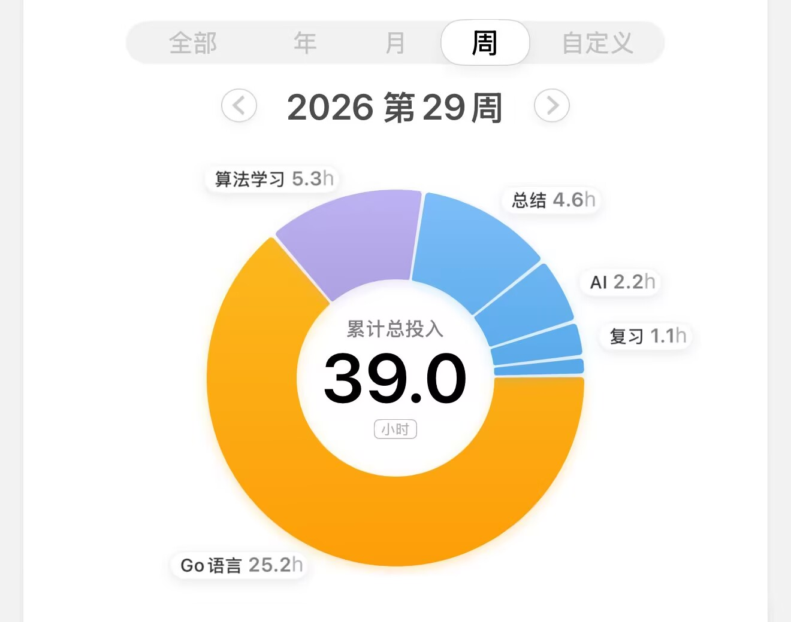
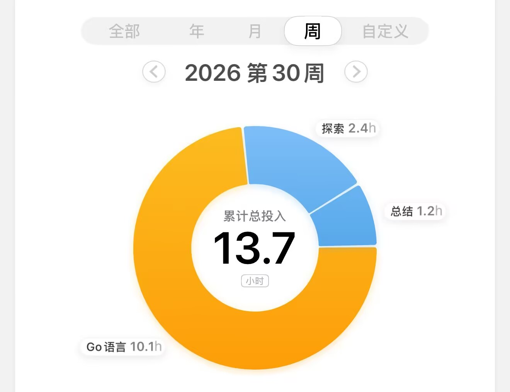

## 我做了什么

可以说, 我持续学习了 一周半(今天是周三)

上周学习了 `7天`, 没什么公司的事 无非就是开几个同步会

总共学习时间 `39h` ，那么一天学习时间大概在 `5.7h` 左右

大部分实现在 `golang` 语言上面 ，少部分在算法和总结上面

  

### 一些想说的话

**承认我很累:**

不得不承认一天学习 `6h` 很累，超他妈的超级累

我回想一下我每天的生活

早上

9:00 起床  - 9:30 开始学习 - 10:40左右休息

11:00 学习 - 11:40 休息

12:00 吃饭 - 13:00午休结束

早上总共预计 `1h` + `40min` = `1h40min` 的学习时间

下午

13:10 学习 - 14:30 结束

14:50 学习 - 15:50 结束

16:00 - 18:00 开始发散

下午的有效学习可能只在 `2h` 另外`2h` 印象中不是那么有效

晚上

18:00 - 19:00 期间做饭，无氧锻炼

19:00 - 20:00 洗澡吃饭

20:00 - 21:00 休息，玩游戏

21:00 - 22:00 (可能会跑步或者是散步，跑步的话会要一个小时，散步的话只要半个小时)

22:00 - 23:00 (之前这段时间会去学习算法，但是最近一直在和女朋友聊天)

23:00 - 00:00 (写算法题，总结，这段时间最近也在和女朋友聊天)

00:00 - 0:30 睡觉

晚上的有效学习时间预计也只在 `2h` ，但是最近一直在和女朋友聊天。


就算是我算上 下午的不高效学习时间 和 女朋友聊天的时间 那么一天也有 `7h40min` 的时间,但是这好累，就是为了多出这 `4h`

从利益的角度考虑，确实一天多学习了 `4h` 确实比一天学习 `3h` 的多一天 但是这样好累

另外吐槽一下 

自从不上班之后，他妈的周六周天都没了，一直在他妈的学


**我方向歪了？**

我不知道是不是我方向歪了，说实话我在 `Go`上面已经投入了 `52h` 

按我之前实习准备来说这`52h` 都够我写`3个项目了`

1. 一个 博客系统 。 亮点在于 点赞服务的设计，缓存的控制，ES，Grafana QPS的处理
2. 一个 geeRPC 框架
3. 一个 基于 RPC的聊天室

但是反观我现在得到了什么

1. 一个只完成了 `1/3` 的项目，目前只完成了 

```
使用 DDD 进行项目架构, TDD 进行业务开发
支持 微信、SMS、邮箱注册登陆的方式, 使用多种限流算法进行无登陆态的限流 . 自选型通过 cookie+JWT 进行维护登陆权限和状态控制
使用装饰器以及面向接口设计,封装和二次开发 日志组件 和 监控组件 以及配置组件
使用 K8S 进行线上环境的部署
支持分级数据展示,设计线上表和开发表. 实现多台实例上的一致性问题
支持 MySQL 平滑迁移到 Mongodb . 设计并实现 SMS 的熔断以及限流业务
```

后面还有

```
待实现 Kafka 点赞、榜单设计、微服务拆分、分布式任务调度、ELK、支付、秒杀、Feed流设计
```

说实话有点后悔了，我是随便找了一个 24年的训练营的 课程走的 。 当然也不能说是随便 只能说是最全面当下最好的系统课了

总共 21周的 视频，一周平均 `3` 个 `3h` 的视频 总共时长 `189h`

说实话 这比 [当初规划](https://ddlgitgzzhm.github.io/p/fire-workd-02/#%E6%88%91%E7%9A%84%E6%83%B3%E6%B3%95) 翻了好几倍

而且说实话这个课程有我只能给到中规中矩的评价

优点

1. 资料比较详细
2. 核心场景，面试考点，实际开发中的情况都有介绍

缺点

1. 时长太长了，内容体量很大
2. 多个模块之间可能没什么关联，例如 引入了 Mongodb 和 k8s 也只是为了实现 dao层级的切换，以及简单的部署。但是讲完之后后面就再也没用到了
3. 有一些代码并没有在课上完成，也就是就算`189h`学习完成后，可能还需要多花`90h`用来处理其他内容

说实话 不后悔是假的，如果我真想要找下一份工作

我应该把实习的项目捡起来，花`20h`记住，然后再花`30h-40h`的时间准备`AI Agent`那个仙骨

然后再花 `40h`准备面经，但是现在好像上了贼船


### 小总结

我不知道应该怎么走，但是我要继续走

这里简单算一笔账 ， 课时总共 `21周`，那么一周我学习`7周` 的内容 `3周`就能解决

这要求我一天基本上就要解决掉`一周`的学习内容 大概 `9h` ,算上倍数 `4.5h`

感觉是可以的

那么我就需要把每天学习的时间 `[3h40min , 7h40min]` 改成 `6h40min` 

这样子我可以使用多出来的 `2h` 进行很好的复习和总结


那么如果我把玩游戏的`1h`拿出来呢？如果我把晚上睡前的`1h`拿出来呢？

或许学生时代的我有这个精力

## 总结

简单理清了一下现状

第一个月 :

1. 完成 `21周` 学习的内容
2. 保证每周平均每天 `6h40min`的学习时间 ，其中 `4h` 放在 `go`上面，当然如果一天学习了一周的内容，可以考虑往后吞并一周 或者是进行总结
3. 其余`2h`用于算法的学习 以及总结

第二个月 :

1. 把原先的精力放在 熟悉八股文
2. 模拟面试
3. 面经
4. 算法题

第二个月底+第三个月 尝试开始投递

---

写给我自己 :

我承认这很难，但是计算下来看着也不是没有完成的希望 。 最近学习破防了好几次，总感觉来不及，但是计算下来发现是可以完成的

我清楚的知道这两个月会很枯燥 也会很难 可能没有结果 也能会有坏结果 但是我当下能做的也只有这个