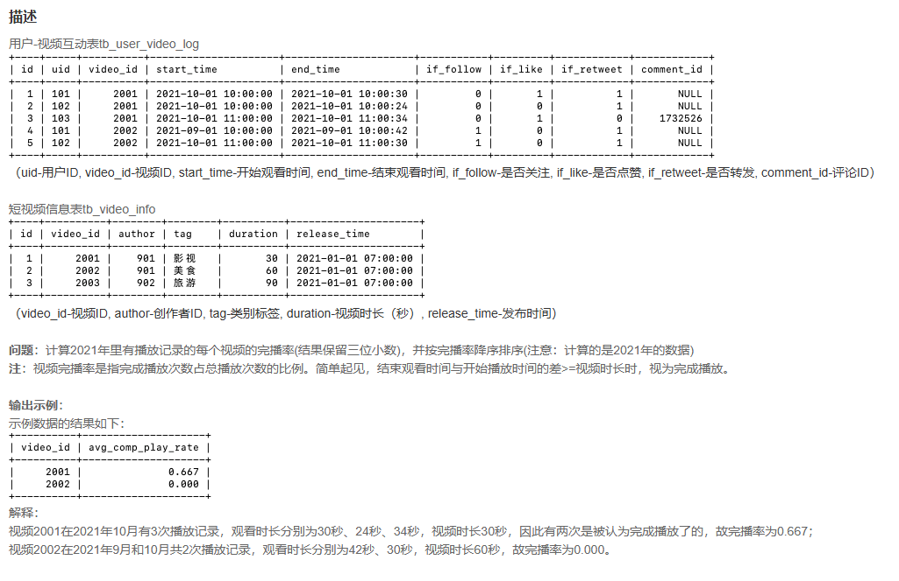
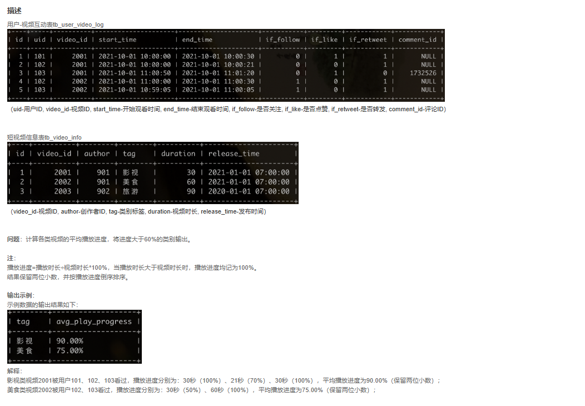

## 某音短视频

### 各个视频的平均完播率

**题目 :**



> Q : 如何计算两个列的差值

A : 使用 `TIMESTAMPDIFF(unit, start_time, end_tiem)` 或者是 使用 `DATEDIFF(end_date, start_time)`

1. 如果使用 `DATEDIFF` 返回的是 相差的天数
2. 对于使用 `TIMESTAMPDIFF` 可以使用下列枚举值 `SECOND`, `MINUTE` , `HOUR`, `DAY`, `WEEK`, `MONTH`, `YEAR`

**思路 :**

1. 我们需要计算出单条的完播率 `TIMESTAMPDIFF() / duration`
2. 然后需要统计出一个视频的完播率 `SUM ( TIMESTAMPDIFF() / duration  ) /  count(tb_user_video_log)`
3. 由于我们需要计算的 `duration` 在另外一张表, 所以我们可以考虑将 `video_info` 表的信息 `left join` 到我们的 `video_log` 表中
4. 另外我们需要注意的是 这个题目只需要处理 `2021` 的数据, 也就是我们只需要 `join` 到 `where year  = 2021` 的数据

````sql
select 
    tbl.video_id,
    ROUND(SUM(IF (TIMESTAMPDIFF(second, tbl.start_time, tbl.end_time) >= tbv.duration, 1, 0)) / count(*),3) as avg_comp_play_rate
from 
    tb_user_video_log as tbl left join 
    tb_video_info as tbv 
    on tbl.video_id = tbv.video_id 
    where year(tbl.end_time) = 2021
group by tbl.video_id
order by avg_comp_play_rate desc 
````

### 平均播放进度大于60%的视频类别

**题目 :**



> Q : 如何展示百分比 

A : 我们可以使用 `CONTRACT(value , _suffix)` 的形式加上 `%` 

> 坑点 : 可能用户会超播, 导致计算的数超过 100% 

A : 我们这里需要使用 `LEAST(value , limit_value)` 而不是 `MIN(A,B)` , `MIN` 函数在 SQL 中是一个聚合函数, 我们应该使用 `LEAST`


**思路 :** 

1. 同样我们需要计算单个条的播放率 `LEAST( TIMESTAMPDIFF , DURATION ) , DURATION`
2. 然后我们需要计算单个视频的播放率 `LEAST( ... ) / DURATION`
3. 由于这里输出的结果是 `TAG` 那么我们考虑先根据 `vedio_id` 分组, 分组后 再聚合 `video_info` 的信息 重新查一遍

````sql
select 
    tbv.tag, 
    temp.avg_play_progress
from (
select 
    tbv.video_id,
    CONCAT( 
        ROUND( 
                SUM(LEAST( TIMESTAMPDIFF(SECOND, tbl.start_time, tbl.end_time) , tbv.duration) / tbv.duration)  
                    / count(*) * 100 ,
             2),
                    '%')  as avg_play_progress
from 
    tb_user_video_log as tbl left join 
    tb_video_info as tbv 
    on tbl.video_id = tbv.video_id 
group by tbv.video_id
having avg_play_progress > 60
order by avg_play_progress desc 
) as temp  left join  
    tb_video_info as tbv 
    on temp.video_id = tbv.video_id
````

### TODO 