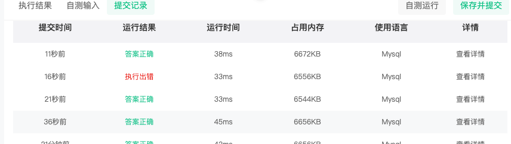

## 基础排序
### 查询后排序

1. `asc` 升序 ascending 
2. `desc` 降序 descending
````sql
select device_id, age from user_profile order by age asc
````
[牛客网题目链接](https://www.nowcoder.com/practice/cd4c5f3a64b4411eb4810e28afed6f54?tpId=199&tqId=2002632&sourceUrl=%2Fexam%2Foj%3FquestionJobId%3D10%26subTabName%3Donline_coding_page)


[牛客网题目链接 (降序排列)](https://www.nowcoder.com/practice/d023ae0191e0414ca1b19451099a39f1?tpId=199&tqId=2002634&sourceUrl=%2Fexam%2Foj%3FquestionJobId%3D10%26subTabName%3Donline_coding_page)
### 查询后多列排序
1. 多列排序使用`,` 隔开
2. 不指定排序顺序，默认是 `asc`
````sql
select device_id,gpa,age from user_profile order by gpa asc,  age asc

SELECT device_id,gpa,age from user_profile order by gpa,age;默认以升序排列
SELECT device_id,gpa,age from user_profile order by gpa,age asc;
SELECT device_id,gpa,age from user_profile order by gpa asc,age asc;
````
[牛客网题目链接](https://www.nowcoder.com/practice/39f74706f8d94d37865a82ffb7ba67d3?tpId=199&tqId=2002633&sourceUrl=%2Fexam%2Foj%3FquestionJobId%3D10%26subTabName%3Donline_coding_page)

## 基础操作符
### 查找学校是北大的学生信息

1. 我们可以通过 `where` 子句来筛选对应的记录
````sql
select device_id, university from user_profile where university  = '北京大学'
````

2. 该题背景 : device_id 和 university 为联合索引
   
    在这个背景下面，我们可以在查询的时候使用联合索引，少去一层回表查询的操作  **todo** , DBM 不会自己合上id吗
````sql
Select device_id,university FROM user_profile where university = "北京大学" and device_id = user_profile.device_id;
````

[牛客网题目链接](https://www.nowcoder.com/practice/7858f3e234bc4d85b81b9a6c3926f49f?tpId=199&tqId=1971248&sourceUrl=%2Fexam%2Foj%3FquestionJobId%3D10%26subTabName%3Donline_coding_page)

### 查询年龄大于 24岁的用户信息
1. 引入逻辑运算符 `>` 以此类推还有 `< , = ,  >= , <= , != , = `
````sql
select device_id, gender, age,university from user_profile where age > 24
````
[牛客网题目链接](select device_id, gender, age,university from user_profile where age > 24)

### 查询某个年龄段的用户信息

1. 使用 `between and`  和 `>= and  <=`  没什么本质区别，性能和业务使用上无差别
2. 不过相较于`between and` 逻辑表达式更灵活

````sql
select device_id, gender, age from user_profile where age >= 20 and age <= 23

SELECT device_id, gender, age
FROM user_profile
WHERE age BETWEEN 20 AND 23;
````
[牛客网题目链接](https://www.nowcoder.com/practice/be54223075cc43ceb20e4ce8a8e3e340?tpId=199&tqId=1971603&sourceUrl=%2Fexam%2Foj%3FquestionJobId%3D10%26subTabName%3Donline_coding_page)

### 查找除复旦大学的用户信息
1. `NOT IN` 可以比较多个值, 对于 `<> !=` 如果需要比较多个值需要引入 `and`
2. `<>` 和 `!=` 没有本质区别，不过一般都是写 `<>` 除非团队开发有要求，那么使用 `!=` 尽可能统一组内的代码风格
````sql
select device_id,gender,age,university from user_profile where university <> '复旦大学'
select device_id,gender,age,university from user_profile where university != '复旦大学'
select device_id,gender,age,university from user_profile where university NOT IN ("复旦大学")
````
[牛客网题目链接](https://www.nowcoder.com/practice/c12a056497404d1ea782308a7b821f9c?tpId=199&tqId=1971604&sourceUrl=%2Fexam%2Foj%3FquestionJobId%3D10%26subTabName%3Donline_coding_page)

### 用 where 过滤空值
1. 可以单独是用 `is not null`  或者是单独使用 `<> ""`
2. 但是实际业务最好是两个一起使用 ～
````sql
select device_id,gender,age,university
from user_profile 
where age is not null and age <> ""
````
[牛客网题目链接](https://www.nowcoder.com/practice/08c9846a423540319eea4be44e339e35?tpId=199&tqId=1971605&sourceUrl=%2Fexam%2Foj%3FquestionJobId%3D10%26subTabName%3Donline_coding_page)