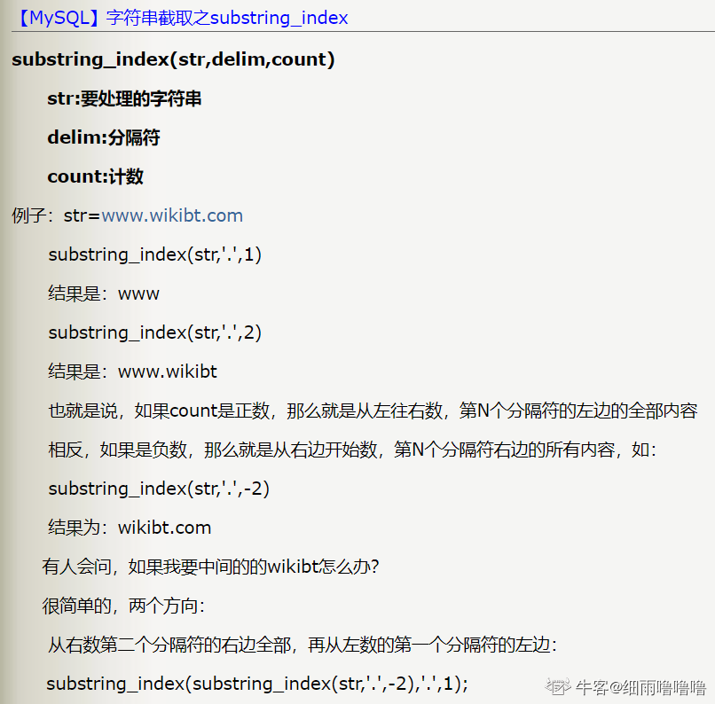

## 文本函数
### 统计每种性别的人数
> 题目：现在运营举办了一场比赛，收到了一些参赛申请，表数据记录形式如下所示，现在运营想要统计每个性别的用户分别有多少参赛者，请取出相应结果
>
> 示例：user_submit
>
> | device_id | profile           | blog_url               |  
> |-----------|-------------------|------------------------|  
> | 2138      | 180cm,75kg,27,male | http:/url/bigboy777    |  
>
> 根据示例，你的查询应返回以下结果：
>
> | gender | number |  
> |--------|--------|  
> | male   | 2      |  
> | female | 1      |  

新知识点

> Q : 如何拆分 一个列里面的数据, 然后进行分组

A : `SUBSTRING_INDEX(profile, ',', -1) AS gender`
   1. `profile` 需要处理的字符串字段
   2. `,` 分隔符
   3. `-1` 从字符串右侧开始截取, 第一个出现的分隔符后面的 **所有内容**

````sql
select 
    SUBSTRING_INDEX(profile,',',-1) AS gender,
    COUNT(*) as number 
from 
    user_submit
group by
    gender 
````

其他方法 :
注意famale 和 male 有重合的地方，所以不能直接like male，否则female 也会被统计进 ‘male’
````sql
SELECT 
CASE 
WHEN profile LIKE '%,male' then 'male'
WHEN profile LIKE '%,female' then 'female'
else '其他'
end as gender,
COUNT(*) AS number 
FROM user_submit
GROUP BY gender;

SELECT IF(profile LIKE '%female','female','male') gender,COUNT(*) number
FROM user_submit
GROUP BY gender;
````
[题目链接](https://www.nowcoder.com/practice/f04189f92f8d4f6fa0f383d413af7cb8?tpId=199&tqId=1975682&sourceUrl=%2Fexam%2Foj)

## Todo 待完善